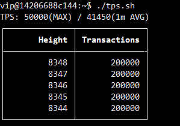

# Benchmark Token Transfer

The performance observer gives realtime performance information for block height, number of transctions in each block, max TPS and average TPS over 60 seconds.
>Please note the observer only starts to output TPS when the node cluster is actively processing transctions

```shell
$ python tps.py http://frontend-service-ip:8080
```



##  1. Test balance transfer between accounts

Benchmarking system performance with 5 million balance transfer transactions between 5 million user addresses

```shell
$ bash sendtxs.sh /data/simple_transfer_5m/ http://frontend-service-ip:8080
```


## 2. Troubleshooting

In interactive mode, if you ran the code snippets provided in the documents and got unexpected results, the cause may be complicated. There are a couple of things you can do for a quick fix:

1. Check if the account you used to sign transactions has enough balance to pay the gas by calling *Cli.getBalance(address)*
2. Find another account from */data/genesis_accounts_5m.txt* and try again.
